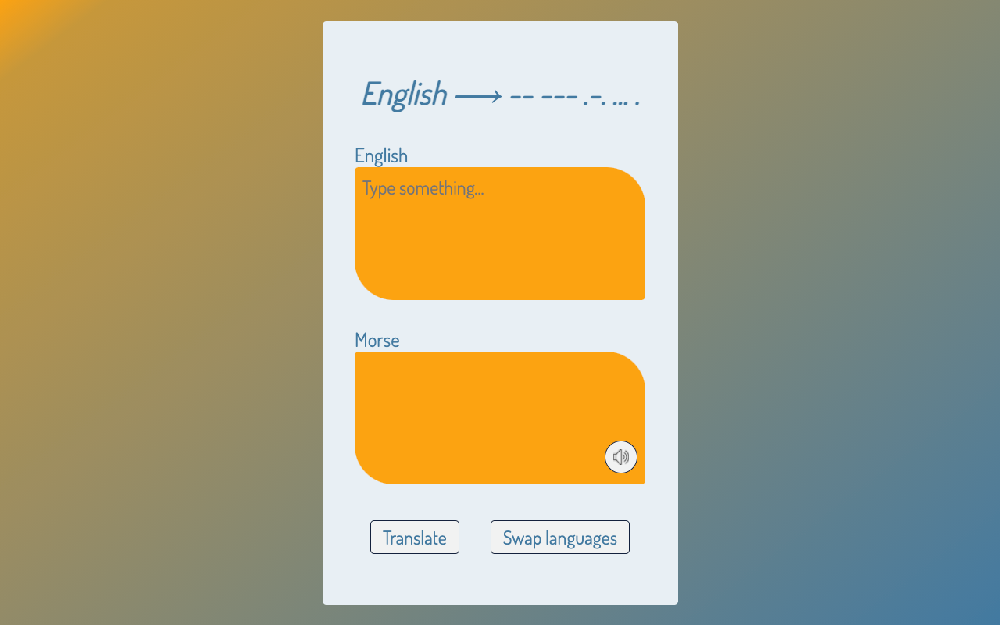

# Morse - English Translator
A translator to convert English into morse code and back, can be viewed [here](https://agjordan.github.io/morse-translator/).

## Motivation
Built to explore HTML, CSS, JS without libraries using a functional programming approach
Learning about unit testing with Jest and setting up a CI/CD pipeline with Github Actions
Using Audio and Speech Synthesis to turn textual data into audio

## Screenshots

## Tech/framework used
- HTML
- Sass
- Vanilla JS
- Jest

## Features
Translates English -> Morse Code
Translates Morse Code -> English
Plays morse input as audio
Speech to text for English

## Tests
Tested with jest
Automated with Github Actions
